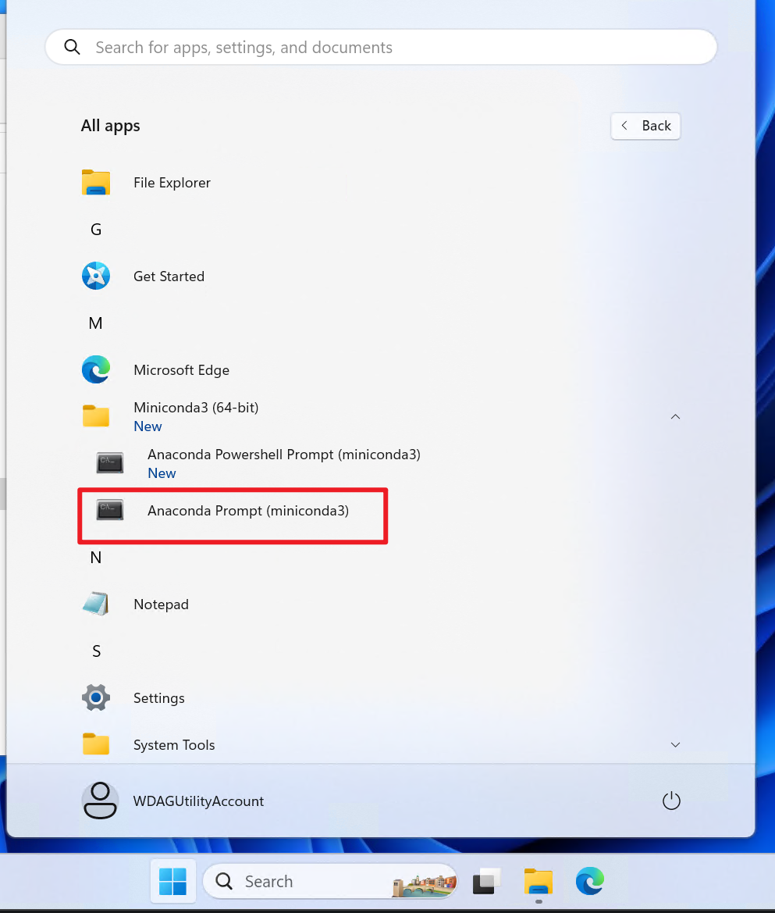
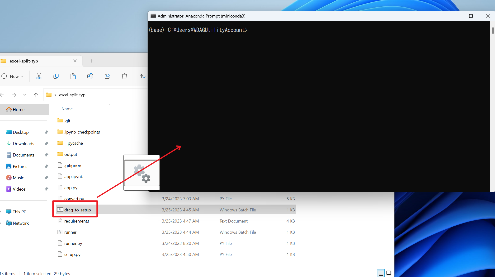
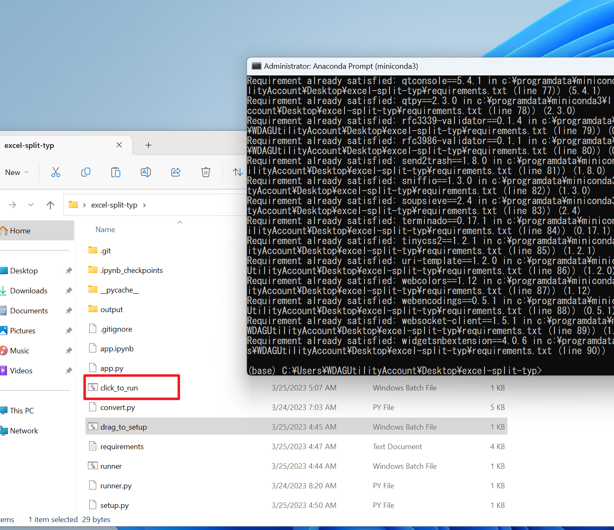

# Jupyter Runner

## How to run on Windows without any python environment

### Installations (only need to do once)

- Download and install [MiniConda](https://docs.conda.io/en/latest/miniconda.html) with Python 3.8~3.9
  
- Click Start Menu -> All Apps -> MiniConda3 -> Anaconda Prompt
  

- Drag `drag_to_setup.bat` to the Anaconda Prompt window, then press Enter
  

- The needed packages will be installed automatically, and a `click_to_run.bat` will be created
  

- Close the Anaconda Prompt window

### Run

- Double click `click_to_run.bat`, your explorer will be opened automatically